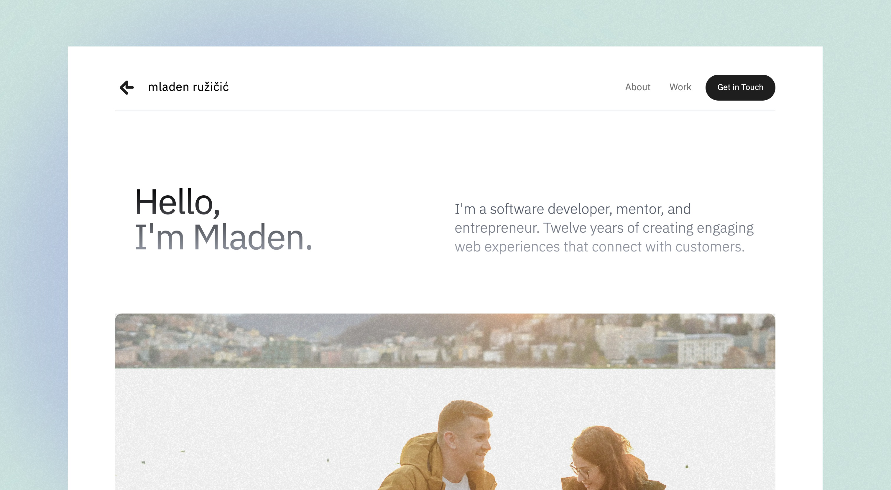

# Personal website



## Introduction

Visit: [mladenruzicic.com](https://mladenruzicic.com)

My personal website. A [MIT](./LICENSE.md) licensed, simple, easily modifiable, statically-exportable. Built using modern TypeScript, based on create-next-app with App Router, Tailwind, GitHub Actions, and many other useful technologies.

## Getting Started

```bash
# Clone the repo
git clone git@github.com:ruzicic/mladenruzicic.com.git

# Navigate to the project
cd mladenruzicic.com

# Install dependencies
yarn

# Run the next.js app
yarn dev
```

Open [http://localhost:3000](http://localhost:3000) with your browser to see the result.

## Contributing

If you find a bug, please [email me](mailto:me@mladenruzicic.com), submit a pull request (I'll buy you a coffee as a thank you), or submit an issue.

## Acknowledgements

- Design based on [Leevi Webflow template](https://leevi-template.webflow.io/) by [Pawel Gola](https://gola.io/)

## License

[MIT](./LICENSE.md)
